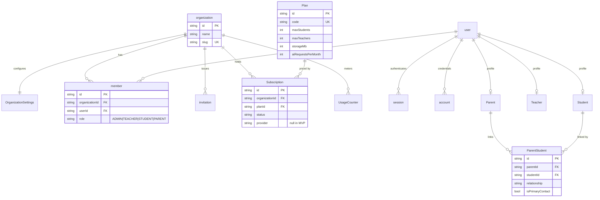
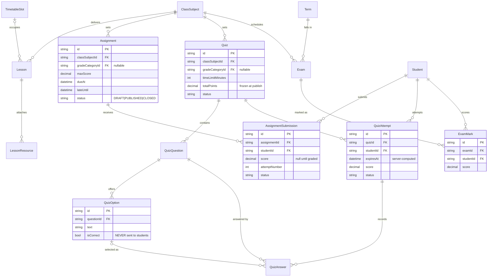
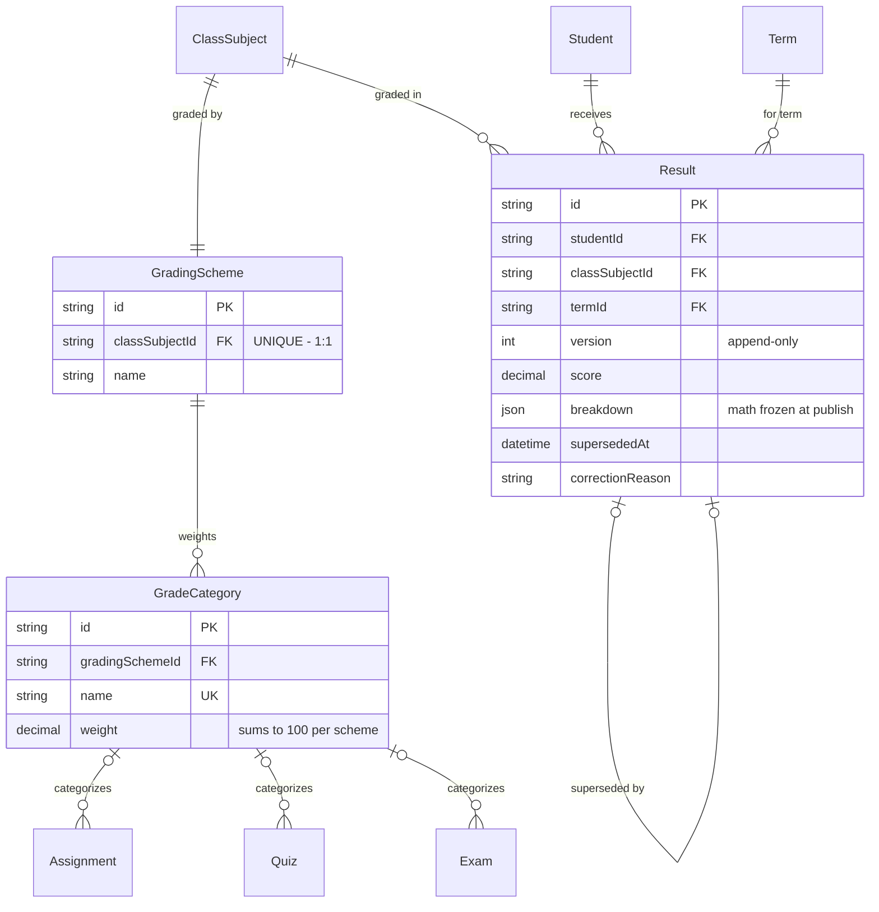
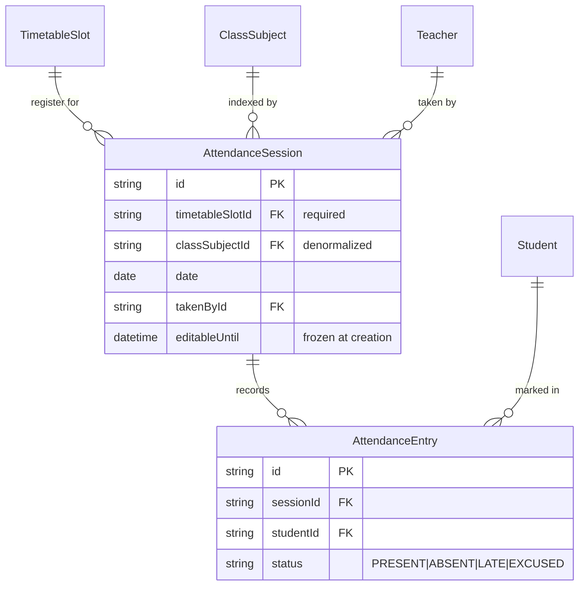

# Karma — Entity Relationship Diagram

> Companion to [DATABASE_SCHEMA.md](./DATABASE_SCHEMA.md). Field-level detail lives there; this is
> the shape of the model.
>
> `organizationId` is omitted from the diagrams below — **every domain entity has one**. Showing it
> 40 times would obscure the structure it is meant to protect.

---

## 1. How to read the model in one minute

Karma has one structural idea, and the rest follows from it:

```text
Class  ──┐
         ├──►  ClassSubject  ◄──────────  everything taught
Subject ─┤          ▲
         │          │
Teacher ─┘          └── Lesson · Assignment · Quiz · Exam · TimetableSlot
                        GradingScheme · AttendanceSession
```

**`ClassSubject` is the spine.** It says *this class studies this subject, taught by this teacher*.
Nothing academic attaches to a bare `classId` + `subjectId` pair, which makes an invalid pairing
unrepresentable and puts `teacherId` one join away from every authorization check.

Three other things to know:

1. **`Class` is year-scoped.** "10A" in 2025/26 is a different row from "10A" in 2026/27. Academic
   year bounds therefore fall out of the structure rather than being repeated everywhere.
2. **Scores live on the record that produced them.** There is no `Grade` or `Mark` table.
3. **`Result` is a frozen snapshot**, versioned and append-only — not a live calculation.

---

## 2. Identity & tenancy



**Notes**

- `user`, `session`, `account`, `verification`, `organization`, `member`, `invitation` are **owned
  by Better Auth**. Karma reads them and hangs profiles off `user`.
- There is **no `Admin` profile** — an admin is a `user` whose `member.role` is `ADMIN`.
- `Plan` is the only entity **not** tenant-scoped.
- **`ParentStudent` is the entire basis of parent authorization.** Every parent-scoped query in the
  system joins through this one table.

---

## 3. Academic structure — the spine

```mermaid
erDiagram
    AcademicYear ||--o{ Term : "divided into"
    AcademicYear ||--o{ Class : "contains"

    Class ||--o{ ClassSubject : "studies"
    Subject ||--o{ ClassSubject : "taught as"
    Teacher ||--o{ ClassSubject : "teaches"
    Teacher ||--o{ TeacherSubject : "qualified in"
    Subject ||--o{ TeacherSubject : "qualifies"
    Teacher |o--o{ Class : "homeroom of"

    Class ||--o{ StudentEnrollment : "enrolls"
    Student ||--o{ StudentEnrollment : "enrolled in"
    AcademicYear ||--o{ StudentEnrollment : "scopes"

    ClassSubject ||--o{ TimetableSlot : "scheduled as"

    AcademicYear {
        string id PK
        string name UK "2025/2026"
        date startDate
        date endDate
        string status "UPCOMING|ACTIVE|CLOSED"
    }
    Term {
        string id PK
        string academicYearId FK
        int order UK
        date startDate
        date endDate
    }
    Class {
        string id PK
        string academicYearId FK
        string name UK "10A, per year"
        int gradeLevel
        string homeroomTeacherId FK
    }
    Subject {
        string id PK
        string code UK
        string name
        string nameAr
    }
    ClassSubject {
        string id PK
        string classId FK
        string subjectId FK
        string teacherId FK
    }
    TeacherSubject {
        string id PK
        string teacherId FK
        string subjectId FK
    }
    StudentEnrollment {
        string id PK
        string studentId FK
        string classId FK
        string academicYearId FK
        string status
    }
    TimetableSlot {
        string id PK
        string classSubjectId FK
        string dayOfWeek
        int startMinute
        int endMinute
        string room
    }
```

**Cardinalities that matter**

| Relationship | Cardinality | Constraint |
|---|---|---|
| `Class` ↔ `Subject` | many-to-many **through `ClassSubject`** | `unique(classId, subjectId)` |
| `Teacher` ↔ `Subject` | many-to-many **through `TeacherSubject`** | `unique(teacherId, subjectId)` — *qualification* |
| `ClassSubject` → `Teacher` | many-to-one | the *actual assignment*, validated against `TeacherSubject` |
| `Student` ↔ `Class` | many-to-many **through `StudentEnrollment`** | one `ACTIVE` row per student per year (partial unique index) |
| `Class` → `Teacher` | optional many-to-one | homeroom teacher, `SetNull` |

**Two levels of teacher-to-subject association**, deliberately kept apart:
`TeacherSubject` = *can teach*. `ClassSubject.teacherId` = *does teach, to this class*.

---

## 4. Learning & assessment



**Uniqueness that encodes product rules**

| Constraint | Rule it enforces |
|---|---|
| `unique(assignmentId, studentId)` | One submission record per student; resubmission bumps `attemptNumber` |
| `unique(quizId, studentId)` | **Single attempt**, enforced by the database rather than by hope |
| `unique(attemptId, questionId)` | One answer per question per attempt |
| `unique(examId, studentId)` | One mark per student per exam |
| `unique(quizId, order)` | Deterministic question ordering |

`QuizOption.isCorrect` is the answer key. The student DTO is a **separate type without the field** —
not the same type with the value stripped at runtime.

---

## 5. Grading and results



### The grading pipeline, end to end

```text
AssignmentSubmission.score ─┐
QuizAttempt.score ──────────┼──► grouped by GradeCategory
ExamMark.score ─────────────┘         │
                                      ▼
                        category average × category weight
                                      │
                                      ▼
                          summed → Result.score  (frozen)
                          detail  → Result.breakdown (frozen)
```

**Three things this diagram is asserting:**

1. **No `Grade` entity, no `Mark` entity.** A raw score lives on the row that produced it. The only
   place the word "mark" appears is `ExamMark`, which means exactly one student's score on one
   offline exam.
2. **`Result` is append-only and versioned.** A correction inserts `version + 1`, sets
   `supersededAt`/`supersededById` on the previous row, requires `correctionReason`, and writes an
   audit entry. `Result` also self-references — the `|o--o|` edge is the supersession chain.
3. **`breakdown` is what makes immutability meaningful.** It stores the per-category arithmetic as it
   stood at publication, so a parent can still see *how* a number was reached even after the
   underlying submissions change.

`GradingScheme` ↔ `ClassSubject` is **1:1** (`classSubjectId` is unique). Categories are optional on
graded items, so ungraded practice work is representable.

---

## 6. Attendance



**Attendance hangs off the timetable slot, not the lesson.** A `Lesson` is content; a
`TimetableSlot` is time. Both reference the slot and neither depends on the other, so a register can
be taken for a period where no lesson content was ever posted — which is what actually happens in
schools.

`unique(timetableSlotId, date)` — one register per period per day.
`unique(sessionId, studentId)` — one status per student per register.

`editableUntil` is frozen at creation so that changing the organization's edit-window policy does
not retroactively reopen or close historical sessions.

---

## 7. Communication, AI, and platform

```mermaid
erDiagram
    Announcement ||--o{ AnnouncementClass : "targets"
    Announcement ||--o{ AnnouncementAttachment : "attaches"
    Class ||--o{ AnnouncementClass : "targeted by"
    Event ||--o{ EventClass : "targets"
    Class ||--o{ EventClass : "targeted by"
    user ||--o{ Notification : "receives"

    user ||--o{ AIConversation : "owns"
    AIConversation ||--o{ AIMessage : "contains"
    FileAsset |o--o{ DocumentChunk : "embedded from"

    FileAsset ||--o{ LessonResource : "stored as"
    FileAsset ||--o{ AssignmentResource : "stored as"
    FileAsset ||--o{ SubmissionFile : "stored as"
    user ||--o{ AuditLog : "acted"

    Notification {
        string id PK
        string recipientUserId FK
        string titleKey "translation key"
        json params
        string resourceType
        string resourceId
        datetime readAt
    }
    DocumentChunk {
        string id PK
        string sourceType
        string sourceId
        string content
        vector embedding "pgvector 1536"
    }
    AuditLog {
        string id PK
        string actorUserId FK "nullable"
        string action
        string resourceType
        string resourceId
        json before
        json after
        string reason
    }
    FileAsset {
        string id PK
        string cloudinaryPublicId UK
        int sizeBytes "feeds STORAGE_MB usage"
        string context
        datetime deletedAt
    }
```

**Notes**

- **Notifications store translation keys plus params**, never rendered sentences — that is what lets
  a notification written under an English session render correctly in Arabic later.
- **`AuditLog` is insert-only.** No `updatedAt` column exists, deliberately. `actorUserId` is
  nullable so system-generated actions are recordable.
- **`DocumentChunk.embedding` is `Unsupported("vector(1536)")`.** Prisma cannot query it — retrieval
  uses `$queryRaw`, which the tenant extension **does not cover**. The `organizationId` filter must
  be written into that raw query by hand and tested, or vector search will cross tenants.
- Targeting is modeled identically for `Event` and `Announcement`: an `audienceType` discriminator,
  a `Role[]` array, and a class join table.

---

## 8. Reference: entity inventory

| Group | Entities | Owner |
|---|---|---|
| Identity | `user`, `session`, `account`, `verification`, `organization`, `member`, `invitation` | Better Auth |
| Config | `OrganizationSettings` | Karma |
| SaaS | `Plan`*, `Subscription`, `UsageCounter` | Karma |
| Profiles | `Student`, `Teacher`, `Parent`, `ParentStudent` | Karma |
| Structure | `AcademicYear`, `Term`, `Class`, `Subject`, `ClassSubject`, `TeacherSubject`, `StudentEnrollment`, `TimetableSlot` | Karma |
| Learning | `Lesson`, `LessonResource`, `Assignment`, `AssignmentResource`, `AssignmentSubmission`, `SubmissionFile` | Karma |
| Assessment | `Quiz`, `QuizQuestion`, `QuizOption`, `QuizAttempt`, `QuizAnswer`, `Exam`, `ExamMark` | Karma |
| Grading | `GradingScheme`, `GradeCategory`, `Result` | Karma |
| Attendance | `AttendanceSession`, `AttendanceEntry` | Karma |
| Communication | `Event`, `EventClass`, `Announcement`, `AnnouncementClass`, `AnnouncementAttachment`, `Notification` | Karma |
| AI | `AIConversation`, `AIMessage`, `DocumentChunk` | Karma |
| Platform | `FileAsset`, `AuditLog` | Karma |

\* `Plan` is the only entity not scoped by `organizationId`.

**Total: 7 library-managed + 38 Karma-owned models.**
